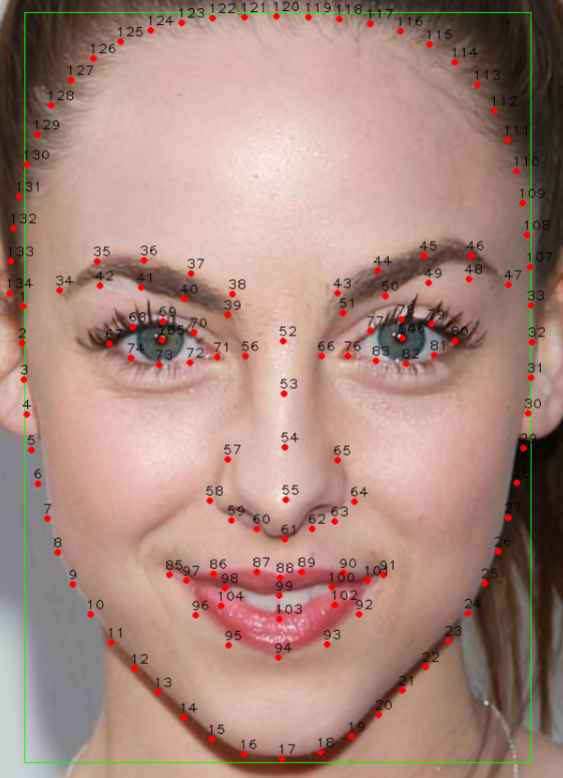

# FaceImageKit

Python实现的高性能人脸图像相关算法Pipeline（人脸检测、134人脸关键点、人脸分割等）。

# License

本项目采用双重许可：

- 开源版：AGPL-3.0。开源项目、个人和学术用途可免费使用；衍生作品需按 AGPL-3.0 要求开源；闭源商业项目不能在未遵守 AGPL-3.0 开源义务的情况下使用。
- 商业版：付费授权。闭源商业项目可使用，可免除 AGPL-3.0 开源义务，并可按授权协议获得技术支持。

商业授权请联系：blake120386@163.com

---

# Install

## python 环境配置
推荐使用 [uv](https://github.com/astral-sh/uv) 管理虚拟环境：
```bash
uv venv --python 3.12
source .venv/bin/activate
```

## 部署依赖 (Deploy)
根据推理目标后端选择安装对应依赖：

### CPU (ONNXRuntime)
```shell
uv pip install -e .[cpu]
# 或 pip install -e .[cpu]
```

### CUDA / GPU (ONNXRuntime-GPU)
```shell
uv pip install -e .[cuda]
# 或 pip install -e .[cuda]
```

### RKNN PC 端模拟器 (rknn-toolkit2)
适用于 x86_64 PC 主机进行模型转换、量化与模拟运行调试：
```shell
uv pip install -e .[rknn]
# 或 pip install -e .[rknn]
```

### RKNN 开发板 / 边缘端 NPU (rknn-toolkit-lite2)
适用于 RK3588 / Orange Pi / RK3576 / RK3568 等 Linux aarch64 开发板运行环境：

```shell
# 1. 安装板端环境依赖（严格锁定 numpy==1.26.4、opencv==4.11.0.* 及 psutil/ruamel.yaml）
pip install -e .[rknn-lite]

# 2. 手动安装官方 rknn-toolkit-lite2 whl（务必加 --no-deps，避免 pip 从 PyPI 自动拉取 numpy 2.x 覆盖 1.26.4）
python -m pip install --no-deps path/to/rknn_toolkit_lite2-2.3.2-cp310-cp310-manylinux_2_17_aarch64.whl
```
> [!IMPORTANT]
> 瑞芯微官方 `rknn_toolkit_lite2` 安装包未在 PyPI 托管，其 whl 元数据仅声明 `numpy` 依赖（未设版本上限）。若安装时未加 `--no-deps`，pip 会默认安装最新的 `numpy 2.x`，导致底层 C-API 冲突并引发运行时崩溃。请务必先安装 `.[rknn-lite]` 环境再加 `--no-deps` 安装 whl。


---

## 开发依赖 (Develop)
```shell
# CPU 开发环境
uv sync --extra cpu

# GPU / CUDA 开发环境
uv sync --extra cuda

# RKNN 开发环境
uv sync --extra rknn

# 完整测试与代码格式化工具
uv sync --extra dev --extra cpu
```

---

# Quick Start

## 人脸检测与 134 关键点 Pipeline

检测流水线 `FaceLandmarkPipeline`（人脸检测 SCRFD -> 134 关键点 RTMPose）：

```bash
# 1. 使用 OpenCV DNN 后端
python examples/facelandmark_pipeline_demo.py \
    -det_weight /home/tf/PycharmProjects/face/weights/scrfd/onnx/scrfd_2.5g_gnkps_shape640x640.onnx \
    -ld_weight /home/tf/PycharmProjects/face/weights/rtmface-m/mmdeploy/end2end.onnx \
    -det_engine OpencvInfer \
    -ld_engine OpencvInfer

# 2. 使用 ONNXRuntime 后端 (CPU/GPU)
python examples/facelandmark_pipeline_demo.py \
    -det_weight /home/tf/PycharmProjects/face/weights/scrfd/onnx/scrfd_2.5g_gnkps_shape640x640.onnx \
    -ld_weight /home/tf/PycharmProjects/face/weights/rtmface-m/mmdeploy/end2end.onnx \
    -det_engine ONNXInfer \
    -ld_engine ONNXInfer \
    -hd cpu

# 3. 使用 RKNN 后端 (PC 模拟器模式：手动指定 .onnx 模型进行模拟运行)
python examples/facelandmark_pipeline_demo.py \
    -det_weight /home/tf/PycharmProjects/face/weights/scrfd/onnx/scrfd_2.5g_gnkps_shape640x640.onnx \
    -ld_weight /home/tf/PycharmProjects/face/weights/rtmface-m/mmdeploy/end2end.onnx \
    -det_engine RKNNInfer \
    -ld_engine RKNNInfer

# 4. 使用 RKNN 后端 (板端 NPU 或 ADB 连板：手动指定 .rknn 实体模型与硬件平台)
# 支持 RK3588 / RK3588S（3核 6 TOPS 架构），可通过 --core_mask 指定多核调度模式 (all / auto / 0 / 1 / 2)
python examples/facelandmark_pipeline_demo.py \
    -det_weight weights/rknn/scrfd_2.5g_gnkps_shape640x640_rk3588_fp16.rknn \
    -ld_weight weights/rknn/rtmface_m_134_256x256_rk3588_fp16.rknn \
    -det_engine RKNNInfer \
    -ld_engine RKNNInfer \
    -hd rk3588s \
    --core_mask all
```

运行结果图像与预测坐标 JSON（`det_box`, `lds`, `box`）将自动保存至 `outputs/` 目录。

---

## RKNN 模型转换与精度验证工具

项目在 `examples/rknn/` 提供了全套模型转换与 ONNX vs RKNN 精度对比脚本：

### 1. ONNX 转 RKNN 模型 (支持 FP16 / INT8 / 混合运算量化)
一键将 SCRFD 2.5G/10G 与 RTMPose 转换为指定硬件（如 `rk3588s` / `rk3588`）的 RKNN 模型：
```bash
# 模式 A: FP16 高精度模型（无量化损失，NPU 原生 FP16 加速）
python examples/rknn/convert_to_rknn.py --target_platform rk3588s --dtype fp16

# 模式 B: 混合运算量化 (INT8 卷积主干 + FP16/INT16 敏感层自动回退，兼顾 6 TOPS 极致吞吐与高精度)
python examples/rknn/convert_to_rknn.py \
    --target_platform rk3588s \
    --dtype hybrid \
    --dataset /path/to/dataset.txt \
    --auto_hybrid_cos_thresh 0.98
```
输出位于 `weights/rknn/`。

### 2. ONNX vs RKNN 精度与数值对齐分析
多维度对比张量余弦相似度、人脸检测 IoU、134 关键点像素误差：
```bash
python examples/rknn/compare_onnx_rknn.py --target_platform rk3588s
```
- SCRFD 检测框 IoU 达到 **99.97% ~ 100.00%**。
- RTMPose 134 关键点坐标中位数误差 (Median Error) 达到 **0.0000 px**。

### 3. RK3588 / RK3588S (6 TOPS) 多核调度与混合精度特性说明
- **平台二进制兼容**：RK3588S 与 RK3588 拥有完全相同的 RKNPU3 计算核心架构，RKNN 官方模型完全通用兼容。
- **6 TOPS 3 核调度**：
  - `core_mask="all"` 或 `7`：启用全部 3 个 NPU 核心，释放完整 6 TOPS 峰值算力。
  - `core_mask="auto"` 或 `0`：驱动层根据负载自动在空闲核心间动态分发任务。
  - `core_mask="0" / "1" / "2"`：锁定单核心运行（每核 2 TOPS），支持双模型多流水线并行隔离。
- **混合运算支持**：支持 INT4/INT8/INT16/FP16，推荐通过 `--auto_hybrid` 自动将关键点/坐标敏感算子提升至 FP16/INT16 计算，其余密集算子保持 INT8 高吞吐。

---

# Models

## Face Detection
### scrfd
Models accuracy on WiderFace benchmark:
| Model            | Easy  | Medium | Hard  |
| :--------------- | :---: | :----: | :---: |
| scrfd_10g_gnkps  | 95.51 | 94.12  | 82.14 |
| scrfd_2.5g_gnkps | 93.57 | 91.70  | 76.08 |
| scrfd_500m_gnkps | 88.70 | 86.11  | 63.57 |

来源：https://github.com/SthPhoenix/InsightFace-REST/

**支持的推理运行时 (Runtime)**:
- [x] onnxruntime (cpu, cuda)
- [x] opencv (cpu, cuda)
- [x] RKNN (`RKNNInfer`: 支持 PC 模拟器及 rk3588, rk3576, rk3568, rk3566 等 NPU 硬件)
- [ ] TensorRT


## Face Landmark
数据集: Lapa134 (Lapa106 + 28)
### rtmface
模型输出大小: $134\times 2$

关键点定义说明：



| Model                 |  NME   |
| :-------------------- | :----: |
| rtmpose-m-ort-lapa134 | 0.0288 |
| rtmpose-s-ort-lapa134 | 0.0258 |

**支持的推理运行时 (Runtime)**:
- [x] onnxruntime (cpu, cuda)
- [x] opencv (cpu, cuda)
- [x] RKNN (`RKNNInfer`: 支持 PC 模拟器及 rk3588, rk3576, rk3568, rk3566 等 NPU 硬件)
- [ ] TensorRT


## Face Segmentation
### ppliteseg
项目来源：https://github.com/tfrbt/FaceSeg.git

- label map 类别数量32
  
| id   |      class      |
| :--- | :-------------: |
| 0    |  'background'   |
| 1    |     'skin'      |
| 2    |     'cheek'     |
| 3    |     'chin'      |
| 4    |      'ear'      |
| 5    |     'helix'     |
| 6    |    'lobule'     |
| 7    |  'bottom_lid'   |
| 8    |     'pupil'     |
| 9    |     'iris'      |
| 10   |    'sclera'     |
| 11   |   'tear_duct'   |
| 12   |    'top_lid'    |
| 13   |    'eyebrow'    |
| 14   |    'forhead'    |
| 15   |     'frown'     |
| 16   |     'hair'      |
| 17   |    'temple'     |
| 18   |      'jaw'      |
| 19   |     'beard'     |
| 20   | 'inferior_lip'  |
| 21   | 'oral comisure' |
| 22   | 'superior_lip'  |
| 23   |     'teeth'     |
| 24   |     'neck'      |
| 25   |     'nose'      |
| 26   |   'ala_nose'    |
| 27   |    'bridge'     |
| 28   |   'nose_tip'    |
| 29   |    'nostril'    |
| 30   |     'DU26'      |
| 31   |   'sideburns'   |

| Model                | val IOU | val Dice |
| :------------------- | :-----: | :------: |
| face_seg_ppliteseg_t |  0.727  |  0.834   |

- [x] onnxruntime (cpu)
- [ ] TensorRT

- label map 类别数量12

| id   |           class            |
| :--- | :------------------------: |
| 0    |   "background"  # 0.背景   |
| 1    |      "skin"  # 1.皮肤      |
| 2    |      "eye"  # 2.眼睛       |
| 3    |     "pupil"  # 3.瞳孔      |
| 4    |  "bottom_lid", # 4.下眼皮  |
| 5    |   "top_lid", # 5.上眼皮    |
| 6    |    "eyebrow"  # 6.眉毛     |
| 7    |      "hair"  # 7.头发      |
| 8    | "superior_lip"  # 8上嘴唇  |
| 9    |     "teeth"  # 9.牙齿      |
| 10   | "inferior_lip" # 10.下嘴唇 |
| 11   |      "nose" # 11.鼻子      |

| Model                 | val IOU | val Dice |
| :-------------------- | :-----: | :------: |
| face12_seg_pplitesegb |  0.774  |  0.869   |

- [x] onnxruntime (cpu)
- [ ] TensorRT
